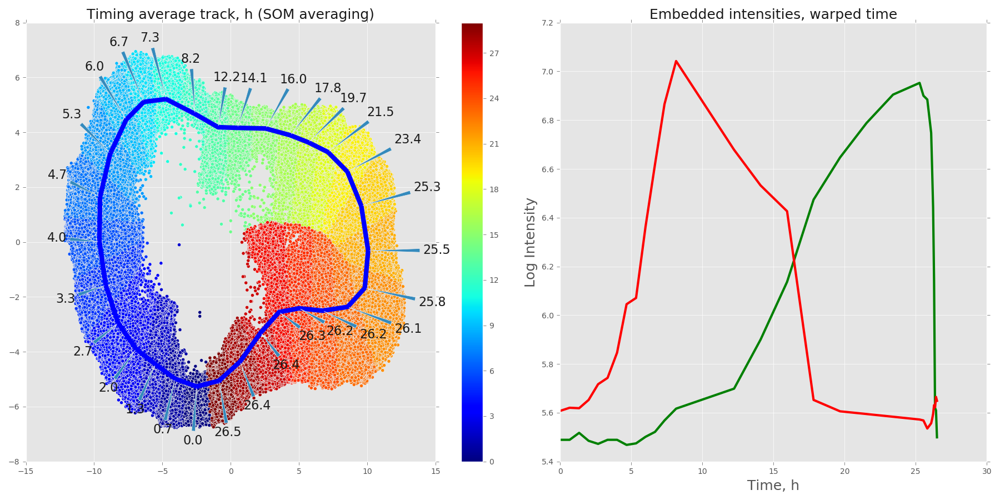

# DeepCycle

This README outlines the steps required to reproduce the approach presented in the manuscript [Rappez et al. DeepCycle reconstructs a cyclic cell cycle trajectory from unsegmented cell images using convolutional neural networks. Molecular Systems Biology, 2020](https://www.embopress.org/doi/full/10.15252/msb.20209474). These instructions show how to run the model on the data used in the paper and on new unseen data.

#### Requirements
[keras](https://keras.io), [UMAP](https://github.com/lmcinnes/umap), [cv2](https://pypi.org/project/opencv-python/), [albumentations](https://github.com/albumentations-team/albumentations), [classification_models](https://github.com/qubvel/classification_models)  
Install customized version of [SOMPY](https://github.com/alexander-rakhlin/SOMPY)

#### How to run
##### Prepare the DeepCycle paper data
1. Download data from [EBI BioStudies repository](https://www.ebi.ac.uk/biostudies/studies/S-BSST323) and deep learning models from [our EMBL hosting](https://oc.embl.de/index.php/s/aTtsCjYqGuI4cqj)
2. Unzip to `data/Timelapse_2019` folder preserving directory structure. You will have: 
    ```
    root|
        |-data|
        |     |-Timelapse_2019|
        |                     |-BF/
        |                     |-Cy3/
        |                     |-DAPI/
        |                     |-GFP/
        |                     |-curated_tracks.csv
        |                     |- ...
        |-src/
        |...
    ```

##### Prepare new timelapse and tracking data
Alternatively, DeepCycle can be run on newly generated data. For that, prepare the data as follows: 
1. Organize the live-imaging microsocpy. Each channel of every timepoint are stored independently as: 
    ```
    root|
        |-data|
        |     |-New_timelapse_data|
        |                         |-BF/
        |                         |-Cy3/
        |                         |-DAPI/
        |                         |-GFP/
    ```
2. Run TrackMate FIJI plugin on the nuclear staining channel (DAPI in our case). The output should be called `Spots in tracks statistics.csv`.
3. Run `src/TrackMate_filter.py` with the correct paths (see comments in file) to manually curate the tracks with one or two divisions.

##### Run DeepCycle
1. `cd src`
2. Prepare the data:  
`python data_prepare.py`
    - Cleans and removes unnecessary columns. Stores as `statistics_clean.csv` in `data/Timelapse_2019` dir
    - Aligns the curated tracks based on division events, calculates mean intensities track/frame wise. Stores as `intensities.csv`  
    - Calculates intensity statistics and adds virtual class `1-4` to each tracked cell. Resulting data to be stored in `statistics_mean_std.csv`
3. Train the model:  
`python model_train.py`  
Trains the model  on curated tracks (less double division tracks) using double division tracks as validation set. Saves best models in `checkpoints` dir
4. Generate cell descriptors with `checkpoint.r34.sz48.03-0.73.hdf5` as default model:
    - from validation set (double division tracks) only:  
    `python encode.py --mode encode_val`  
    - from all available tracks:  
    `python encode.py --mode encode_all`  
Descriptors are saved in `descriptors.r34.sz48.pkl` and `descriptors_all.r34.sz48.pkl` in `data/Timelapse_2019` dir.    
5. Generate embeddings for all dataset. Compute intense, consider using supplied `embeddings_preds_all_batch<i>.npz` instead:  
`python all_cells_prediction.py`
6. `cd ..`   
7. start `jupyter notebook` and open `timelapse_projection2019.ipynb`  

  
 
